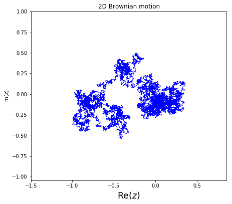
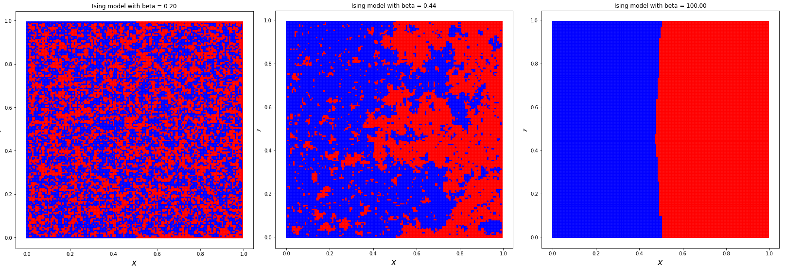

# Complex_analysis


Version:
```
Python (3.6.8)
```


Notebooks: 


- 2D_Brownian_motion.ipynb: Simulations of a planar Brownian motion and a loop erased random walk:




- Ising_model.ipynb: Simulations of the Ising model on a square. Left: high temperature, middle: critical temperature, right: low temperature.




