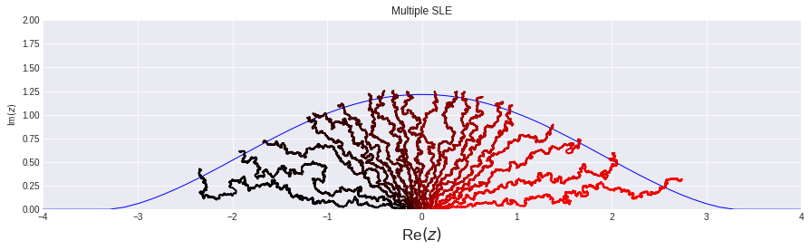
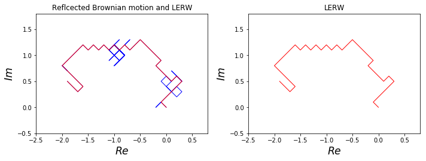
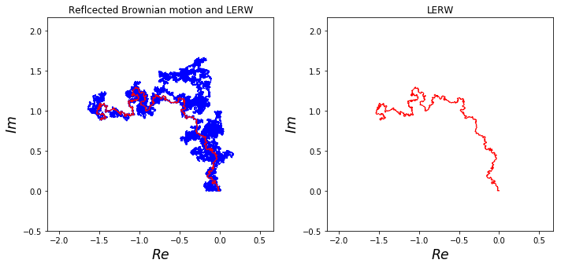
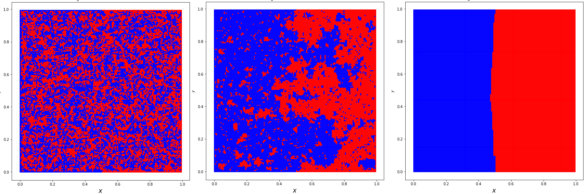

# Complex_analysis


Version:
```
Python (3.6.8)
```


Notebooks: 

- Chordal_multiple_SLE.ipynb, Radial_multiple_SLE.ipynb: Simulations of the chordal/radial multiple slit equation, including multiple SLE. 


 &nbsp;  &nbsp;   &nbsp;   

- 2D_Brownian_motion.ipynb: Simulations of a planar Brownian motion and a loop erased random walk. 




- Ising_model.ipynb: Simulations of the Ising model on a square. (Implementations in R: Ising.R, Ising_boundary.R) Left: high temperature, middle: critical temperature, right: low temperature.




